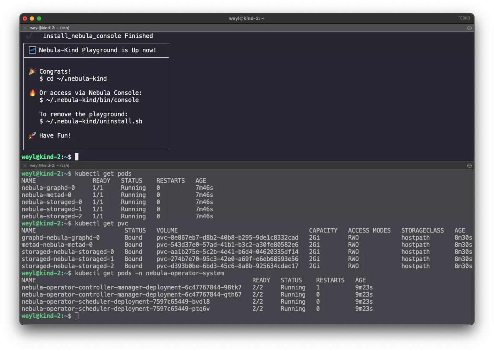

# Nebula Graph on Kind(NGonK)

This is a project inspired by [Carlos Santana](https://twitter.com/csantanapr)'s  [knative-kind](https://github.com/csantanapr/knative-kind), created with ❤️.

With the help of [KIND](https://kind.sigs.k8s.io/)(K8s IN Docker), KGonK helps us provision a dedicated ephemeral K8S cluster with all dependencies inside Docker, including:

- A dynamic storageClass provider
- All third party dependencies of [nebula-operator](https://github.com/vesoft-inc/nebula-operator)
- Nebula-Operator Pods in namespace: `nebula-operator-system`
- The Nebula Graph Cluster Pods in default namespace
- A nodePort service exposing `0.0.0.0:30000` of the host mapped to `graphd:9669`

## How To Use

Just call the following one liner from your Linux Machine:

```bash
curl -sL nebula-kind.siwei.io/install.sh | bash
```

Then you may see something like this:



Also, there are some extended script for different purposes:

> Bootstrap a nebula clsuter on existing KubeSphere All-in-one K8s env:

```bash
curl -sL nebula-kind.siwei.io/install-ks-1.sh | bash
```
> Bootstrap a nebula clsuter on existing K8s single node env:

```bash
curl -sL nebula-kind.siwei.io/install-on-k8s.sh | bash
```

## What's Next?

### Connect via nebula-console

Download the basketball player dataset and import it to the nebula graph:
```bash
wget https://docs.nebula-graph.io/2.0/basketballplayer-2.X.ngql
#### Modify vid format to numeric due to GraphX's limitation.
sed -i 's/player1/11/' basketballplayer-2.X.ngql
sed -i 's/team2/22/' basketballplayer-2.X.ngql
~/.nebula-kind/bin/console -u root -p password --address=127.0.0.1 --port=30000 -f basketballplayer-2.X.ngql
```

Access nebula graph console with this command:
```bash
~/.nebula-kind/bin/console -u root -p password --address=127.0.0.1 --port=30000
```

You could learn more about Nebula-Operator:

| Items                                            | URL                                                          |
| ------------------------------------------------ | ------------------------------------------------------------ |
| Repo                                             | https://github.com/vesoft-inc/nebula-operator                |
| Install Guide                                    | https://github.com/vesoft-inc/nebula-operator/blob/master/doc/user/install_guide.md |
| Sample Nebula Cluster CRD                        | https://github.com/vesoft-inc/nebula-operator/blob/master/config/samples/apps_v1alpha1_nebulacluster.yaml |
| Access Nebula Cluster created by Nebula Operator | https://github.com/vesoft-inc/nebula-operator/blob/master/doc/user/client_service.md |
| Docs of Nebula Graph                             | English: https://docs.nebula-graph.io<br />Chinese: https://docs.nebula-graph.com.cn |

### Try Nebula-Algorithm

To quickly try Nebula Algorithm, we could create a spark pod in same namespace of the nebulaCluster CRD:

```bash
kubectl create -f http://nebula-kind.siwei.io/deployment/spark.yaml
kubectl wait pod --timeout=-1s --for=condition=Ready -l '!job-name'
```

After the spark pod is ready, we could access to the spark container:
```bash
kubectl exec -it deploy/spark-deployment -- bash
```

Then, we could download the nebula-algorithm, i.e. in version `2.6.2`, please refer to https://github.com/vesoft-inc/nebula-algorithm/ for more.

> Note:
> - Official released packages can be found: https://repo1.maven.org/maven2/com/vesoft/nebula-algorithm/
> - Due to https://github.com/vesoft-inc/nebula-algorithm/issues/42 , only 2.6.2+ of nebula algorithm supports K8s.

```bash
wget https://repo1.maven.org/maven2/com/vesoft/nebula-algorithm/2.6.2/nebula-algorithm-2.6.2.jar
wget https://github.com/vesoft-inc/nebula-algorithm/raw/master/nebula-algorithm/src/main/resources/application.conf
```

Then we could change the config file of nebula-algorithm on meta and graph addresses:
```bash
sed -i '/^        metaAddress/c\        metaAddress: \"nebula-metad-0.nebula-metad-headless.default.svc.cluster.local:9559\"' application.conf
sed -i '/^        graphAddress/c\        graphAddress: \"nebula-graphd-0.nebula-graphd-svc.default.svc.cluster.local:9669\"' application.conf
##### change space
sed -i '/^        space/c\        space: basketballplayer' application.conf
##### read data from nebula graph
sed -i '/^    source/c\    source: nebula' application.conf
##### execute algorithm: labelpropagation
sed -i '/^    executeAlgo/c\    executeAlgo: labelpropagation' application.conf
```

Run LPA Algorithm on the basketballplayer graph space:
```bash
/spark/bin/spark-submit --master "local" --conf spark.rpc.askTimeout=6000s \
    --class com.vesoft.nebula.algorithm.Main \
    nebula-algorithm-2.6.2.jar \
    -p application.conf
```

The result was configured in csv file:
```bash
bash-5.0# ls /tmp/count/
_SUCCESS                                                  part-00000-5475f9f4-66b9-426b-b0c2-704f946e54d3-c000.csv
bash-5.0# head /tmp/count/part-00000-5475f9f4-66b9-426b-b0c2-704f946e54d3-c000.csv
_id,lpa
1100,1104
2200,2200
2201,2201
1101,1104
2202,2202
```


## Troubleshooting

### Ensuring docker Permission Failed
You may encounter this error in case docker was not installed before our installation, you could just follow instructions below to run `newgrp docker` and then rerun the installation, it will pass in next go.
```bash
ℹ️    Ensuring Linux Docker Permission

 ❌   Ensuring docker Permission Failed, please try:
 option 0: execute this command and retry:
 $ newgrp docker
 option 1: relogin current shell session and retry install.sh
```

### Some of the K8S resource is not ready(pods)

```bash
ℹ️    Waiting for <foo bar> pods to be ready...
```

There could be different causes:

You could check the reason from another terminal:

```bash
kubectl get pods --all-namespaces
kubectl describe pods <pod_name> -n <namespace_name>
```

- Docker hub pull limit hit
In this case, you can refer to https://medium.com/rossum/how-to-overcome-docker-hub-pull-limits-in-a-kubernetes-cluster-382f317accc1.

If you are in China, [this](https://gist.github.com/y0ngb1n/7e8f16af3242c7815e7ca2f0833d3ea6) may help.

- CPU resource is not enough
Please assign more CPU/RAM to your docker or host machine.
